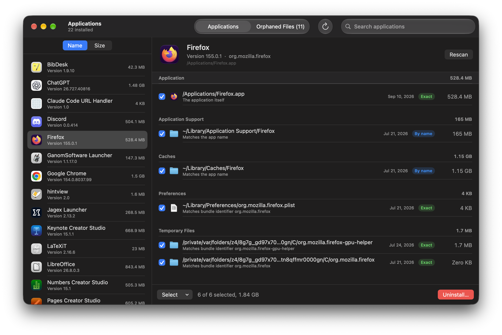
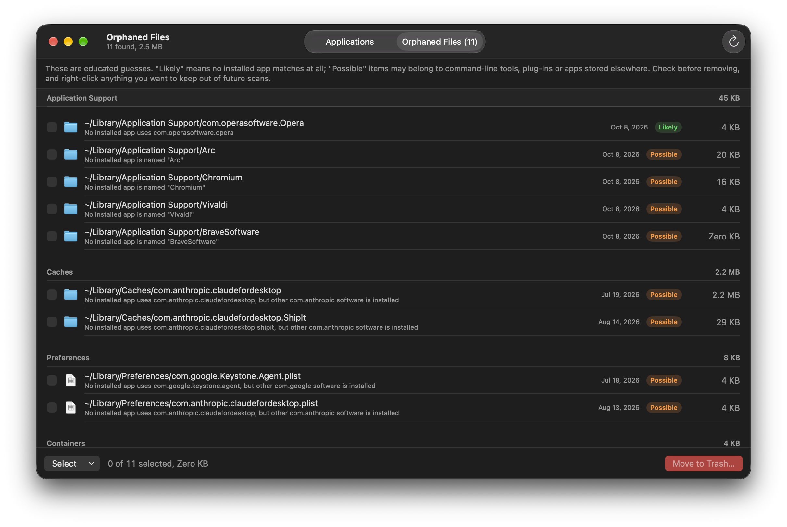

# Uninstaller

A macOS app that removes applications together with the files they leave around the system, and finds leftovers from apps that were only dragged to the Trash.





## Download

Get the latest zipped build from the [Releases page](https://github.com/b-ruth/Simple-Mac-Uninstaller/releases/latest). It runs on Apple silicon and Intel Macs with macOS 14 or later.

The build is not notarized by Apple, so macOS blocks it the first time. After unzipping, either:

- open it once, then go to **System Settings → Privacy & Security** and click **Open Anyway**, or
- run `xattr -dr com.apple.quarantine /path/to/Uninstaller.app` in Terminal.

## Features

- **Uninstall an app completely.** Select an app (or drop one onto the window) to see everything it owns: support files, caches, preferences, containers, saved state, cookies, logs, crash reports, launch agents and daemons, privileged helpers, installer receipts and temp files. Each match is labelled *Exact* (bundle identifier), *By name* or *Maybe*.
- **Find orphaned files.** Compares the Library folders against every installed app and lists what nothing accounts for, labelled *Likely* or *Possible*. Nothing is pre-selected, and items can be ignored in future scans.
- **Nothing is deleted outright.** Everything is moved to the Trash. Items that need administrator rights are handed to Finder, which asks for your password.

Orphan detection is heuristic. Review *Possible* items before removing them.

## Building from source

Requirements:

- macOS 14 or later
- Xcode 16 or later
- [XcodeGen](https://github.com/yonaskolb/XcodeGen) (`brew install xcodegen`) if you add or remove source files

```sh
xcodegen generate   # only needed after changing project.yml or the file layout
xcodebuild -project Uninstaller.xcodeproj -scheme Uninstaller -configuration Debug -derivedDataPath build build
open build/Build/Products/Debug/Uninstaller.app
```

`project.yml` signs with a specific development team. Change `DEVELOPMENT_TEAM` to your own, or set `CODE_SIGN_IDENTITY` to `"-"` for ad-hoc signing.

## Full Disk Access

macOS hides other apps' containers unless Uninstaller has Full Disk Access. Add the built app under **System Settings → Privacy & Security → Full Disk Access**, then relaunch it. The app shows a banner while access is missing.

## Print-only modes

The binary can print scan results without opening a window or removing anything:

```sh
Uninstaller.app/Contents/MacOS/Uninstaller --list-apps
Uninstaller.app/Contents/MacOS/Uninstaller --scan /Applications/Some.app
Uninstaller.app/Contents/MacOS/Uninstaller --orphans
```

## Not covered

- Dotfolders in the home directory (such as `~/.vscode`)
- Kernel and system extensions
- Apps under `/System`, which macOS does not allow removing

## Icon

The app icon is drawn by `Scripts/make_icon.swift`.

## License

MIT. See [LICENSE](LICENSE).
